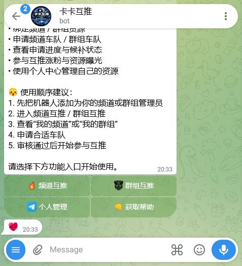
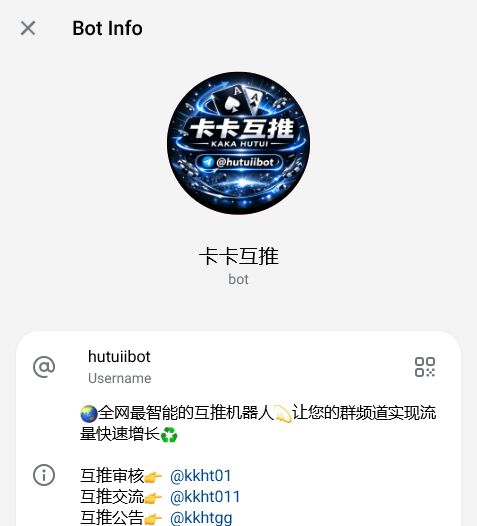

# TG互推机器人｜Telegram频道互推与推广管理工具

**TG互推机器人 @hutuiibot** 服务于 Telegram 频道主、群主和运营人员，用于管理频道或群组之间的互推合作、申请候补与曝光安排。它把分散在私聊里的互推流程集中到一个操作面板中，帮助参与者更清楚地查看资源、申请状态和当前进度。

> 本仓库用于产品介绍、使用教程和版本更新，不包含机器人服务端源代码，也不会上传 Token、API Key、Session、数据库或服务器配置。

## 主要功能

### 绑定频道与群组

用户可以在机器人内管理自己有权运营的频道和群组，为后续互推申请准备基础资料。绑定前应确认账号具有相应管理权限，并保证提交的信息真实。

### 申请互推车队

当前界面提供频道互推车队与群组互推车队入口。频道主可根据自己的资源类型选择对应项目，阅读规则后提交申请。互推车队是合作管理方式，不代表机器人保证流量、排名或收益。

### 候补与进度管理

机器人提供申请列表、候补状态或相关进度入口，方便运营人员查看是否已经加入合作安排。具体排期和参与条件以机器人当时显示的规则为准。

### 曝光参与和个人管理

面板包含参与曝光、个人管理等入口，可用于查看已绑定资源与自身操作记录。运营人员仍需自行检查推广文案、目标受众和频道内容是否符合平台规则。

## 适合哪些用户

- 希望寻找同类频道互推合作的频道主；
- 需要管理多个 Telegram 频道或群组的运营人员；
- 想减少人工登记、排期和候补沟通成本的团队；
- 需要集中查看互推申请与个人资源的管理员。

普通用户如果只想搜索频道和群组，更适合使用 [TG云搜](https://github.com/kaka813/telegram-search-bot)；需要同步授权内容的频道主可查看 [转载机器人](https://github.com/kaka813/telegram-auto-forward-bot)。

## 使用方法

1. 打开 [@hutuiibot](https://t.me/hutuiibot)，点击“开始”；
2. 阅读首页说明和当前互推规则；
3. 在个人管理或资源管理中绑定自己有权管理的频道、群组；
4. 根据资源类型选择频道互推车队或群组互推车队；
5. 查看参与要求并提交申请；
6. 在申请、候补或进度入口查看状态；
7. 获得合作安排后，按约定发布合规内容，并及时核对链接与展示时间。

不要通过虚假订阅量、误导性标题或不相关内容骗取合作。真实、同主题、受众匹配的互推更有长期价值。

## 使用截图

### 1. 互推管理面板

首页展示绑定频道或群组、申请互推车队、查看候补与参与曝光等操作。

### 2. 机器人资料页

资料页用于核对机器人名称和准确用户名，避免进入仿冒账号。

### 3. Telegram公开入口

从公开入口打开后，请确认用户名为 @hutuiibot 再继续操作。

## 常见问题

### 互推机器人会自动带来用户吗？

不会保证。机器人用于组织和管理互推合作，实际曝光取决于频道质量、受众匹配、合作方执行和内容吸引力。

### 频道和群组可以一起申请吗？

界面提供不同资源类型的入口。应根据实际资源选择，并遵守对应车队或活动的最新规则。

### 为什么处于候补状态？

候补通常与当前名额、排期或申请条件有关。请在机器人内查看最新状态，不要重复提交大量相同申请。

### 可以推广任何内容吗？

不可以。参与者必须遵守 Telegram 规则、所在地区法律和具体合作要求，不得发布欺诈、侵权、骚扰或误导性内容。

### 为什么仓库没有源代码？

该仓库定位为官方产品文档，并非开源项目。服务端源码、机器人 Token、Session 和数据库配置均不公开。

## 相关入口

- 立即打开机器人：[@hutuiibot](https://t.me/hutuiibot)
- TG机器人总导航：[Telegram机器人推荐与工具大全](https://github.com/kaka813/tg-telegram-jiqiren-guide)
- 搜索频道和群组：[TG云搜](https://github.com/kaka813/telegram-search-bot)
- 同步授权内容：[Telegram转载机器人](https://github.com/kaka813/telegram-auto-forward-bot)

## 最近更新

**2026-07-19**：创建产品说明页，加入真实操作截图、互推申请流程、候补管理说明和合规提醒。

## 免责声明

本工具用于合法的频道合作管理，不承诺订阅增长、搜索排名、点击量或收益。参与者应自行核实合作对象与推广内容，并承担发布决定产生的责任。功能和规则可能更新，请以 @hutuiibot 内的最新提示为准。
